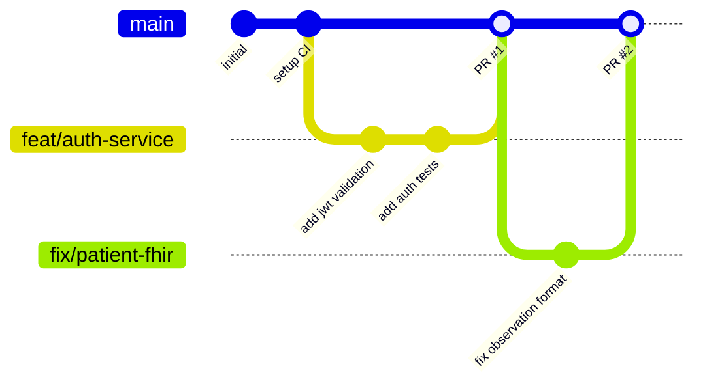

# Git & Development Workflow Specification

Este documento estabelece o fluxo de trabalho Git, governança de branches, padrões de commit e diretrizes de revisão de código para o ecossistema do projeto **Healthcare** (Monorepo Go + React). 

Como um ecossistema clínico de alta criticidade operacional, a integridade da pipeline de entrega é garantida por testes rigorosos, validação automatizada e conformidade estrita com padrões internacionais (FHIR/DICOM).

---

## 1. Estratégia de Branching

Adotamos o modelo **Trunk-Based Development (TBD)** com branches de curta duração (*short-lived feature branches*). Isso evita divergências massivas de código e facilita a integração contínua.



### Regras de Ouro das Branches:
*   A branch `main` representa o estado atual de produção estável. Ela é **protegida** e nunca recebe commits diretos.
*   Todas as modificações são introduzidas via Pull Requests (PRs) a partir de branches temporárias.
*   **Nomenclatura Padrão de Branches:**
    *   Novas funcionalidades: `feat/nome-da-feature` (ex: `feat/patient-history`)
    *   Correções de bugs: `fix/nome-do-bug` (ex: `fix/jwt-expiration`)
    *   Refatoração de código: `refactor/o-que-mudou` (ex: `refactor/redis-connection`)
    *   Infraestrutura / CI: `chore/tarefa` (ex: `chore/github-actions`)
    *   Documentação: `docs/detalhe` (ex: `docs/architecture`)

---

## 2. Padrão de Commits (Conventional Commits)

Exigimos o uso de **Conventional Commits v1.0.0** para garantir um histórico legível, rastreabilidade e geração automática de changelogs.

### Estrutura do Commit:
```text
<tipo>(<escopo>): <descrição curta e objetiva>

[corpo opcional explicando o porquê da mudança]

[rodapé opcional com referências a issues ou breaking changes]
```

### Tipos de Commits Permitidos:
*   `feat`: Introdução de uma nova funcionalidade no ecossistema.
*   `fix`: Correção de bug no backend, frontend ou banco de dados.
*   `docs`: Alteração exclusiva na documentação do projeto.
*   `style`: Alterações de formatação (espaços, ponto e vírgula, etc.) que não afetam a lógica.
*   `refactor`: Mudança no código que não corrige um bug nem adiciona funcionalidade.
*   `test`: Adição ou modificação de testes unitários ou E2E.
*   `chore`: Atualizações de build, infraestrutura, CI ou dependências.

### Exemplos Reais:
*   `feat(auth): implementar interceptor gRPC para validação de JWT`
*   `fix(clinical): corrigir parse de datas no recurso FHIR de Observation`
*   `refactor(imaging): otimizar buffer de transmissão do stream DICOM`
*   `test(patients): adicionar mock de repositório para testes do serviço de cadastro`

---

## 3. Fluxo de Pull Requests (PR) e Code Review

A revisão de código é a nossa primeira e mais importante linha de defesa para segurança e estabilidade clínica.

### Passos para Contribuição:
1.  **Criação da Branch:** Crie a branch de curta duração a partir da `main` mais recente.
2.  **Desenvolvimento:** Codifique seguindo as **regras estritas** de `Zero Comentários` e `Variáveis Descritivas`.
3.  **Testes Locais:** Garanta que todas as suítes de testes estão passando localmente.
4.  **Abertura de PR:** Crie o Pull Request direcionado à `main` preenchendo o template oficial.
5.  **Revisão por Pares:** Ao menos **1 aprovação** de outro engenheiro é obrigatória.
6.  **CI Verde:** A pipeline automatizada de integração (GitHub Actions) deve passar 100%.
7.  **Merge:** Realizado via **Squash and Merge** para manter o histórico da branch principal limpo.

---

## 4. Checklist do Pull Request (Template Oficial)

Ao abrir um PR no GitHub, o autor deve validar e preencher o seguinte formulário:

```markdown
## 📝 Descrição
[Explique resumidamente o objetivo deste Pull Request e o problema que ele resolve]

## 🛠️ O que foi feito?
- [ ] Implementação de lógica de negócio / UI
- [ ] Criação/Modificação de Schemas ou DTOs Protobuf
- [ ] Criação de Migrations SQL (apenas dados operacionais - PostgreSQL)
- [ ] Criação de testes unitários ou de integração

## 🔒 Segurança & Healthcare Compliance (HIPAA/LGPD)
- [ ] **Persistência Correta:** Dados clínicos salvos estritamente no FHIR (GCP Healthcare API); Dados operacionais salvos no Postgres local.
- [ ] **RBAC:** O novo endpoint foi devidamente registrado no interceptor de permissões (`internal/app/interceptor/permissions.go`)?
- [ ] **Sem Segredos:** Verificado que nenhuma chave `.env` ou credenciais foram adicionadas acidentalmente.
- [ ] **Zero Comentários:** O código gerado está 100% livre de comentários redundantes e documentação em linha (autoexplicativo).
- [ ] **Variáveis Descritivas:** Todas as variáveis possuem nomes claros e significativos (sem letras únicas).

## 🧪 Como testar?
1. Comando para rodar testes: `go test -v ./internal/modules/{domain}/...` ou `npm run test`
2. Fluxo manual verificado: [Passo a Passo]
```

---

## 5. Guia de Code Review para Revisores

Ao revisar o código de um colega de equipe, foque nos seguintes pilares:

### 🚨 Regra de Ouro: Sem Comentários & Código Autoexplicativo
*   **Recuse o PR** se houver comentários inline explicativos (ex: `// Inicializa a conexao com o banco`). O código deve falar por si mesmo através de nomes excepcionalmente descritivos.
*   Exemplo de má nomenclatura: `func (r *repo) GetP(id string)` -> **Substituir por**: `func (repository *PatientRepository) GetPatientByID(patientID string)`.

### 🗄️ Arquitetura e Persistência de Dados
*   **Dados Clínicos (Patient, Observation, Encounter, Condition, DiagnosticReport, ImagingStudy):** Devem bater diretamente nos adaptadores FHIR / Healthcare API. Se houver alguma tabela SQL local criada para eles, **solicite refatoração imediata**.
*   **Dados Operacionais (Users, Employees, Appointments):** Devem utilizar PostgreSQL via `pgxpool` com migrations adequadas no diretório `migrations/`.

### 🛡️ Proteção e Permissões
*   Se um novo endpoint gRPC foi criado no backend, o revisor deve garantir que o arquivo `internal/app/interceptor/permissions.go` foi atualizado para conter o mapeamento de permissões (RBAC). Caso contrário, por padrão, o interceptor negará acesso ao novo método.

---

## 6. Pipeline de CI (GitHub Actions)

Toda vez que uma branch recebe um push ou um Pull Request é aberto, a pipeline definida em `.github/workflows/ci.yml` executa automaticamente os seguintes passos:

1.  **Backend (Go):**
    *   Monta ambiente Go.
    *   Faz o download das dependências.
    *   Executa `go vet` para análise estática de qualidade.
    *   Roda toda a suíte de testes unitários e de integração (`go test`).
2.  **Frontend (React + Vite):**
    *   Monta ambiente Node.js.
    *   Instala as dependências via `npm ci` (limpo e determinístico).
    *   Executa o linter (`eslint`) para garantir conformidade estilística.
    *   Realiza o build de produção (`npm run build`) para verificar que não há erros de tipagem TypeScript.
