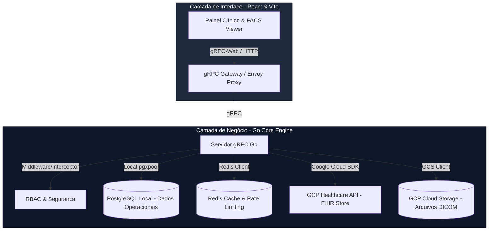

# Healthcare Portal & Core Engine 🏥🧪

Bem-vindo ao repositório unificado (**Monorepo**) do ecossistema **Healthcare**! Esta plataforma de missão crítica e alta performance combina um robusto motor de processamento clínico desenvolvido em **Go + gRPC** com uma interface de alta fidelidade construída em **React + TypeScript + Vite**.

O ecossistema foi projetado desde o primeiro dia para conformidade estrita com as normas **HIPAA/LGPD**, arquitetado para integrar o padrão internacional de prontuário eletrônico **FHIR** e ingestão pesada de exames médicos **DICOM**.

---

## 🏛️ Visão Geral da Arquitetura

O ecossistema divide-se em duas camadas isoladas localizadas no mesmo repositório para facilitar o desenvolvimento, orquestração local e automação de CI/CD:



### 💾 Divisão de Persistência de Dados (Crítica)
*   **Dados Clínicos (Google Cloud Healthcare API):** Dados como `Patient`, `Observation` (sinais vitais), `Encounter` (consultas), `Condition` (diagnósticos) e `DiagnosticReport` (laudos) residem **exclusivamente na nuvem segura da GCP em conformidade FHIR**. Nunca são salvos em tabelas SQL locais.
*   **Dados Operacionais (PostgreSQL local):** Tabelas operacionais de controle de acesso (`auth`), credenciamento da equipe clínica (`staff`) e histórico e catálogo de exames PACS processados (`imaging_studies`).

---

## 📂 Estrutura de Pastas do Monorepo

```text
healthcare/
├── .github/workflows/          # Pipelines de automação CI/CD (GitHub Actions)
├── backend/                    # Core Engine (Go gRPC Server)
│   ├── cmd/api/                # Ponto de entrada (Bootstrapping)
│   ├── internal/               # Kernel da aplicação (Modules e Shared)
│   ├── migrations/             # Migrações SQL puras (PostgreSQL)
│   └── proto/                  # Contratos de APIs e Buffers gRPC (.proto)
├── frontend/                   # Interface Administrativa e PACS (React + Vite)
│   ├── src/                    # Código-fonte da UI, Store (Zustand) e Roteamento
│   ├── src/modules/            # Módulos isolados da interface por contexto
│   └── src/shared/             # Componentes UI (shadcn) e utilitários globais
├── .gitignore                  # Regras de exclusão unificadas (Monorepo)
├── GIT_WORKFLOW.md             # Manual oficial de Governança Git e Code Review
├── AGENTS.MD                   # Blueprint do ecossistema de agentes (Vite + React)
└── GEMINI.md                   # Diretrizes técnicas estruturais Go + React
```

---

## ⚙️ Pré-requisitos de Ambiente

Para executar e testar o ecossistema Healthcare completo em sua máquina local, certifique-se de possuir:

*   **Docker & Docker Compose** (para orquestrar PostgreSQL e Redis locais)
*   **Go 1.21+** (para o servidor backend)
*   **Node.js 20+ & npm** (para a interface web)

---

## 🚀 Inicialização Rápida

### Passo 1: Orquestrar Serviços de Infraestrutura
Inicie os containers do banco de dados PostgreSQL e cache do Redis na raiz do projeto:
```bash
docker compose up -d
```

### Passo 2: Executar o Backend (Go Core Engine)
1. Navegue até a pasta do backend:
   ```bash
   cd backend
   ```
2. Copie o arquivo `.env.example` para `.env` e ajuste as credenciais (caso necessário):
   ```bash
   cp .env.example .env
   ```
3. Instale as dependências e inicie o servidor (as migrações SQL rodam automaticamente no boot):
   ```bash
   go run cmd/api/main.go
   ```

### Passo 3: Executar o Frontend (React + Vite Portal)
1. Em um novo terminal, navegue até a pasta do frontend:
   ```bash
   cd frontend
   ```
2. Instale as dependências do ecossistema Node:
   ```bash
   npm install
   ```
3. Inicie o servidor de desenvolvimento local com Hot Module Replacement (HMR):
   ```bash
   npm run dev
   ```
4. Abra o seu navegador no endereço indicado (por padrão `http://localhost:5173`).

---

## 🧪 Suíte de Testes Automatizados

### Rodando Testes do Backend (Go)
Todos os testes unitários e de integração de serviços utilizam interfaces mockadas para garantir a isolabilidade rápida e alta cobertura de validação lógica:
```bash
cd backend
go test -v ./...
```

### Rodando Validações do Frontend (Linting)
Garante que a codificação cumpre as diretrizes estilísticas estritas do projeto:
```bash
cd frontend
npm run lint
```

---

## 🔄 Governança de Contribuição & Fluxo Git

> [!IMPORTANT]  
> Todos os desenvolvedores e agentes autônomos que atuam neste projeto devem obrigatoriamente seguir a especificação [GIT_WORKFLOW.md](file:///c:/Users/andre/Desktop/Projetos/healthcare/GIT_WORKFLOW.md).
> 
> *   **Sem Comentários inline (Regra Estrita):** O código deve ser 100% autoexplicativo, utilizando nomes de variáveis legíveis e descritivos.
> *   **Conventional Commits:** Todo histórico deve ser escrito no formato semântico de commits (ex: `feat(auth): ...`, `fix(clinical): ...`).
> *   **Aprovação Mandatória:** Nenhum código entra na `main` sem passar pela pipeline de CI do GitHub Actions e por pelo menos uma aprovação de Code Review.
